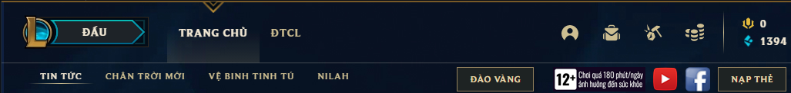

<h1 align="center">
  
</h1>

<h1 align="center">
  <p>Bot auto play League of Legends<p>
  
</h1>

<p align="center">
  Display language:
  <a href="https://github.com/kgemas/League-AI/blob/main/README.md">[Vietnamese]</a>
  -
  <a href="https://github.com/kgemas/League-AI/blob/main/README.EN.md">[English]</a>
</p

What is this?
==========
- This is a self-playing bot of league of legends.
- Released to test new technologies, it uses only publicly available apis and does not interfere with the game at all.
- The way this bot works is to emulate a keyboard and mouse like a player.
<details open>
  <summary>Expand / Shrink</summary>
  <p align="center">
    
  </p>
</details>


Download
==========
- Latest version, please download the file [LeagueAI.zip] (https://github.com/kgemas/League-AI/releases/latest).
- Once the download is done, you can compare it with the md5 hash to ensure that the file you download is safe.


30 seconds install.
===========
- **Step 1**: Open the game app. The screen will have several menus like this.
<p align="center">
  
</p>

- **Step 2**: Open the extracted folder (or install), find the configuration file ```config.json```. Please modify the path to your game folder and save the settings again.
```
// For garena server, point to "32787" directory.
"DefaultLeaguePath": "E:\\GamePC\\Garena\\Games\\32787"
```
> If only used on NA, just delete all garena configuration (or comment again, default to this game server folder is at C:/Riot Games).

- **Step 3**: Run the program ```LeagueAI.exe``` and enter the Key (if any).
- Done 🎉 Keep the screen unlocked and go play 💃

Environmental requirements
===========
- Install .NET Framework 4.7.2 Runtime [Download Here](https://go.microsoft.com/fwlink/?LinkId=863262).
- Download link https://go.microsoft.com/fwlink/?LinkId=863262

Advanced File Customization ```config.json```
===========
```
// server
"hostActive": "https://leaguebot.khaivu.dev"

// the number of games the bot will play on its own
"maxGame": 8,

// 1 = automatic shutdown, 0 = no shutdown
"autoShutdown": 1,

// skill upgrade order
"upgrandSkillMap": {
  "1": "Q",
  "2": "W",
  "3": "E",
  "4": "Q",
  "5": "W",
  "6": "R",
  "7": "Q",
  "8": "W",
}
```

Updates and patches
===========
- To update patches quickly, please download the [LeagueAI Update Bot](https://github.com/kgemas/Tool-Update-LeagueAI/releases/download/v1.0.0/UpdateBotAI.zip). Extract the file ```UpdateBotAI.exe``` and place it in the same folder as the bot ```LeagueAI.exe```.
- Run the file ```UpdateBotAI.exe``` and it will replace the old version by itself.
> For detailed information on how to install and use this update tool, [see more](https://github.com/kgemas/Tool-Update-LeagueAI)

Can't run the software?
===
- As one master said
> *Try updating the software if you get an error 💥 because most likely that problem is solved!*

- You can track **resolved** issues [here](https://github.com/kgemas/League-AI/issues?q=is%3Aissue+is%3Aclosed).

- Or view issues **in progress** [here](https://github.com/kgemas/League-AI/issues?q=is%3Aopen+is%3Aissue).

- In case you get an error you haven't seen before, [create a new issue](https://github.com/kgemas/League-AI/issues/new/choose), it may take a while to fix because I received a request. Please pay attention when opening an issue.

Good luck 🐱‍👤🎶
