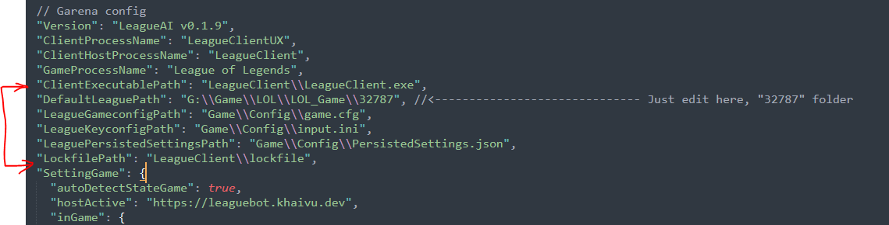

<h1 align="center">
  
</h1>

<h1 align="center">
  <p>Bot auto play League of Legends<p>
  
</h1>


<p align="center">
  Display language:
  <a href="https://github.com/kgemas/League-AI/blob/main/README.md">[Vietnamese]</a>
  -
  <a href="https://github.com/kgemas/League-AI/blob/main/README.EN.md">[English]</a>
</p

Đây là gì?
==========
- Đây là con bot tự chơi game liên minh huyền thoại.
- Được phát hành để thử nghiệm các công nghệ mới, nó chỉ sử dụng các api có sẵn được công khai và hoàn toàn không can thiệp vào game.
- Cách hoạt động của bot này là thao tác bàn phím và chuột giống như người chơi.
<details open>
  <summary>Mở rộng / Thu nhỏ</summary>
  <p align="center">
    
  </p>
</details>

Tải về
==========
- Phiên bản mới nhất, hãy tải về file [LeagueAI.zip](https://github.com/kgemas/League-AI/releases/latest) nhé.
- Sau khi tải xong, các bạn có thể so sánh với mã hash md5 để đảm bảo tệp tin mình tải về là an toàn.


30 giây cài đặt.
===========
- **Bước 1**: Hãy mở game client lên. Màn hình sẽ có mấy menu như này.
<p align="center">
  
</p>

- **Bước 2**: Mở folder đã giải nén (hoặc cài đặt), tìm đến file cấu hình ```config.json```. Hãy sửa đổi đường dẫn đến thư mục game của bạn và lưu cài đặt lại.
```
// Với máy chủ garena, trỏ đến thư mục "32787".
"DefaultLeaguePath": "E:\\GamePC\\Garena\\Games\\32787"
```
> Nếu bạn sử dụng ở máy chỉ NA, chỉ cần xoá hết cấu hình của garena đi (hoặc comment lại, mặc định thì folder game máy chủ này mặc định ở trong C:/Riot Games).

- **Bước 3**: Chạy chương trình ```LeagueAI.exe``` và nhập Key (nếu có).
- Done 🎉 Giữ màn hình không khoá lại và đi chơi thôi 💃

Mô trường hoạt động
===========
- Cài đặt .NET Framework 4.7.2 Runtime [Tải về ở đây](https://go.microsoft.com/fwlink/?LinkId=863262).
- Đường dẫn tải về https://go.microsoft.com/fwlink/?LinkId=863262

Tuỳ chỉnh nâng cao tệp ```config.json```
===========
```
// để hoạt động ổn định, hãy sửa địa chỉ từ
// kemmta.ddns.net:44397 -> leaguebot.khaivu.dev
"hostActive": "https://leaguebot.khaivu.dev"

// số lượng game mà bot sẽ tự chơi
"maxGame": 8,

// 1 = tự động tắt máy, 0 = không tắt máy
"autoShutdown": 1,

// thứ tự upgrade skill
"upgrandSkillMap": {
  "1": "Q",
  "2": "W",
  "3": "E",
  "4": "Q",
  "5": "W",
  "6": "R",
  "7": "Q",
  "8": "W",
}
```

Tuỳ chỉnh nâng cao cho những máy chủ chưa được hỗ trợ
===========
Trong một vài bản phân phối game, có thể bạn sẽ gặp phải trường hợp mà đường dẫn các tệp tin không có giá trị mặc định như trong tệp cài đặt ```appsettings.json```. Cách giải quyết là hãy trỏ từng tệp tin đến đúng địa chỉ của nó. Có 6 tệp tin cần phải cấu hình tay như hình dưới.

<p align="center">
  
</p>

Tuỳ chọn ```DefaultLeaguePath``` là đường dẫn gốc chứa game. Tất cả 5 tuỳ chọn còn lại sẽ có Đường dẫn = DefaultLeaguePath + "giá trị còn lại". Cụ thể hơn, ví dụ như ```LeagueGameconfigPath``` như trong hình sẽ có đường dẫn thật sự là ```G:\\Game\\LOL\\LOL_Game\\32787\\Game\\Config\\game.cfg```.

Bạn hãy tìm đến đúng file và rút gọn đường dẫn lại để nó phù hợp với cách cộng chuỗi. Cho tới khi nhà phát hành sửa chữa, cách cấu hình này vẫn sẽ hoạt động. Bởi vì phần mềm cần sử dụng những cấu hình này để có quyền đọc API.


Cập nhật quan trọng mọi phiên bản.
===========
- Để quá trình hoạt động ổn định, hãy sửa cài đặt ```"hostActive"``` từ ```kemmta.ddns.net:44397``` thành ```leaguebot.khaivu.dev``` nhé.
- Để cập nhật các bản vá lỗi nhanh chóng, các bạn hãy tải về [Bot cập nhật LeagueAI](https://github.com/kgemas/Tool-Update-LeagueAI/releases/download/v1.0.0/UpdateBotAI.zip). Giải nén tệp ```"UpdateBotAI.exe"``` và để chung thư mục với bot ```LeagueAI.exe```.
- Chạy file ```"UpdateBotAI.exe"``` và nó sẽ tự thay thế các bản cũ.
> Chi tiết về cách cài đặt và sử dụng công cụ update này, xem thêm [tại đây](https://github.com/kgemas/Tool-Update-LeagueAI)

Không thể chạy phần mềm?
===
Như một cao nhân đã nói
> Hãy thử cập nhật phần mềm nếu gặp lỗi 💥 vì rất có thể vấn đề đó đã được giải quyết rồi đó!

Các bạn có thể theo dõi những vấn đề **đã được giải quyết** [tại đây](https://github.com/kgemas/League-AI/issues?q=is%3Aissue+is%3Aclosed).

Hoặc xem những vấn đề **đang xử lý** [tại đây](https://github.com/kgemas/League-AI/issues?q=is%3Aopen+is%3Aissue).

Nếu bạn gặp lỗi nào đó mới chưa từng được giải quyết, hãy [tạo một vấn đề mới](https://github.com/kgemas/League-AI/issues/new/choose), có thể sẽ mất 1-2 ngày để tôi giải quyết, nhưng hãy kiên nhẫn nhé 😂

Good luck 🐱‍👤🎶
