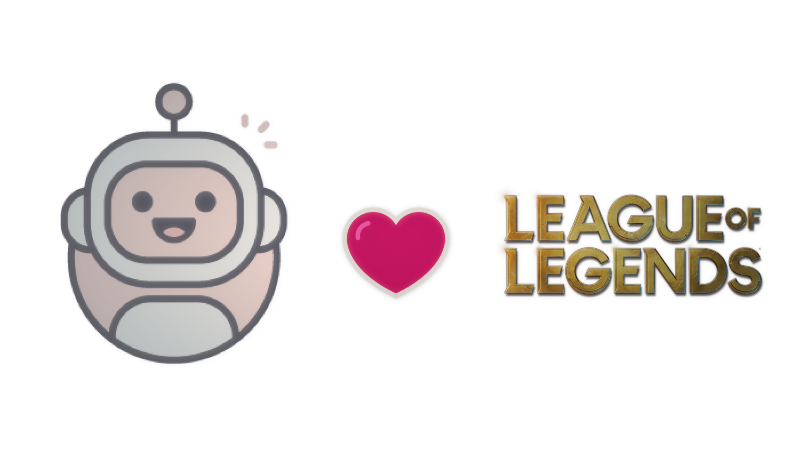

<p align="center">
  
</p>
<p align="center">
  Bot auto play League of Legends
  
</p>

30s Cài đặt.
=============================================================================================
- Đầu tiên hãy mở game lên nè.
- Mở folder đã cài đặt, tìm đến file cấu hình ```config.json```.
- Tiếp theo, hãy sửa đổi đường dẫn đến folder game của bạn và lưu lại.
```
// Chỉnh sửa thư mục game tương ứng ở đây, thư mục "32787"
"DefaultLeaguePath": "E:\\GamePC\\Garena\\Games\\32787"
```

- Sau khi cấu hình xong, khởi chạy chương trình "LeagueAI.exe" và nhập Key (nếu có).
- Để màn hình mở và đi ăn chơi nhảy nhót 💃

Mô trường hoạt động
=============================================================================================
- .NET Framework 4.7.2 Runtime [Tải về ở đây](https://go.microsoft.com/fwlink/?LinkId=863262).

Tuỳ chỉnh nâng cao
=============================================================================================
- Hãy cẩn thận trong khi chỉnh sửa, bạn có thể khám phá các tuỳ chọn khác tại tệp config.json trong thư mục cài đặt.
- Một vài tuỳ chọn khác có thể sử dụng:
```
// số lượng game mà bot sẽ tự chơi
"maxGame": 8,

// 1 = tự động tắt máy, 0 = không tắt máy
"autoShutdown": 1,

// thứ tự upgrade skill
"upgrandSkillMap": {
    "1": "Q",
    "2": "W",
    "3": "E",
    "4": "Q",
    "5": "W",
    "6": "R",
    "7": "Q",
    "8": "W",
  }
```
Cập nhật quan trọng V0.1.0
===
Để có thể cập nhật nhanh chóng bot này, các bạn hãy tải về "Bot cập nhật LeagueAI" [tại đây](https://github.com/kgemas/Tool-Update-LeagueAI/releases/download/v1.0.0/UpdateBotAI.zip).

Tóm tắt: Tải về và giải nén cùng trong folder của bot. Sau đó chạy "UpdateBotAI.exe", nó sẽ tự thay thế các bản cũ.

Không thể chạy phần mềm?
===
Hãy xem những vấn đề đã được giải quyết [tại đây](https://github.com/kgemas/League-AI/issues?q=is%3Aissue+is%3Aclosed).

Good luck 🐱‍👤
